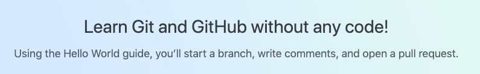
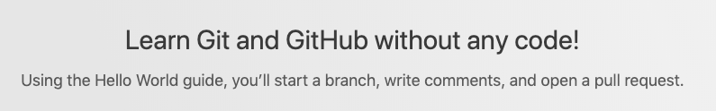
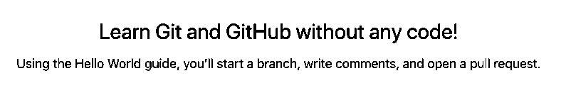
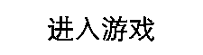

# img
golang image to gray,binaryzation,reverse color


### install

```code
go get github.com/no-bibi/img
```

### demo

```go
package main

import (
	"github.com/no-bibi/img"
)

func main() {

	file, _ := img.Read(`./enter.png`)

	//to make it gray
	grayed := img.Gray(file)
	img.Encode(grayed,`./enter_grap.png`)

	//want binary ? not problem (ps:you can adjust threshold between 0 - 255)
	binary := img.Binary(grayed, 180)
	img.Encode(binaryzation,`./enter_binaryzation.png`)

	//want reverse ? go on with Reverse
	reverse := img.Reverse(binaryzation)
	img.Encode(reverse,`./enter_reverse.png`)
}
```

### work out


<p>original : </p>
<p>gray : </p>
<p>binary : </p>
<p>reverse : </p>


### licenses

[MIT](http://opensource.org/licenses/MIT)

